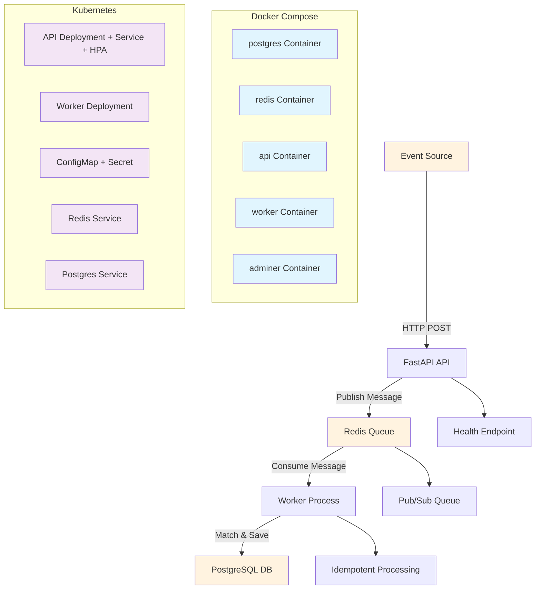

# Architecture Diagram

## Component Descriptions

### API Service (FastAPI)
- Receives events via REST API
- Publishes events to Redis queue
- Provides health checks and campaign management
- Structured JSON logging with trace_id correlation

### Worker Service
- Consumes events from Redis queue
- Matches events against campaign rules
- Saves matching results to PostgreSQL
- Ensures idempotency with unique event IDs

### Data Flow
1. Event → API → Redis Queue → Worker → Database
2. Each step logs with consistent trace_id
3. Health checks ensure service reliability

### Infrastructure Isolation
- Docker Compose for local development
- Kubernetes manifests for production deployment
- Secrets management via K8s ConfigMaps/Secrets
